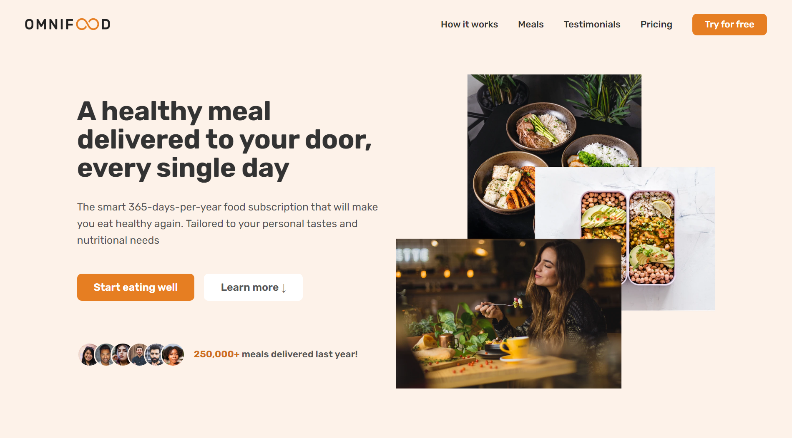

# Omnifood

Omnifood is a fictional premium food delivery service that uses AI to create personalized weekly meal plans for customers.

## Technologies

This project was created with:

- HTML5, CSS3, and JavaScript for the front-end
- jQuery for interactivity
- Font Awesome for icons
- Google Fonts for typography
- Git and GitHub for version control and collaboration

## Demo

You can view the live version of the website here: [alielsheeikh.github.io/Omnifood/](https://alielsheeikh.github.io/Omnifood/)

## Installation

To run this project locally, follow these steps:

1. Clone this repository: `git clone https://github.com/AliElsheeikh/Omnifood.git`
2. Open `index.html` in your browser.

## Features

Omnifood's website has the following features:

- Modern and responsive design with smooth scrolling
- A fully functional navigation menu with a logo and search bar
- A plan section with pricing information and an option to sign up
- A gallery section displaying various food images
- A form to sign up for Omnifood's food delivery service with input validation
- A footer with social media links and legal information

## What I learned

Working on the Omnifood project provided me with a great learning opportunity, where I was able to apply my knowledge and acquire new skills. Some of the things I learned include:

- How to structure web pages using HTML5 semantic elements and attributes, which makes the code more readable and easier to maintain.
- How to use CSS3 to create visually appealing and responsive web pages, including media queries and grids to ensure the website works on different devices.
- How to add interactivity with JavaScript and jQuery, which made the website more engaging and user-friendly, and how to validate input using JavaScript.
- How to use Git and GitHub for version control and collaboration, which helped me to keep track of changes and work with others more effectively.
- How to implement third-party resources such as Font Awesome and Google Fonts to enhance the website's design and typography.

## Acknowledgements

The website design and layout are inspired by Jonas Schmedtmann's Udemy course, Build Responsive Real World Websites with HTML5 and CSS3. The images used in this website are from [Unsplash](https://unsplash.com/).

## Contact

If you have any questions or feedback about this project, feel free to contact me at:

- Email: alielsheeikh@gmail.com
- Twitter: [@AliElsheeikh](https://twitter.com/AliElsheeikh)
- LinkedIn: [Ali Elsheeikh](https://www.linkedin.com/in/alielsheeikh/)
